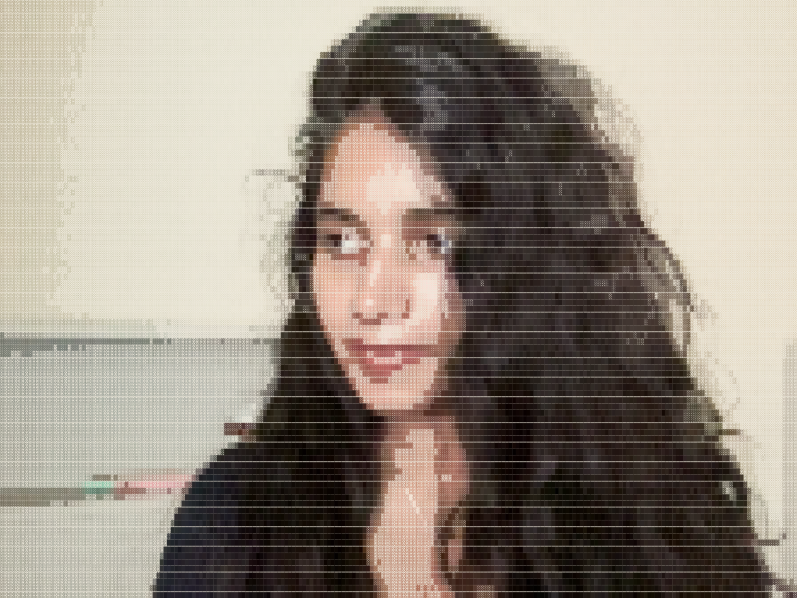
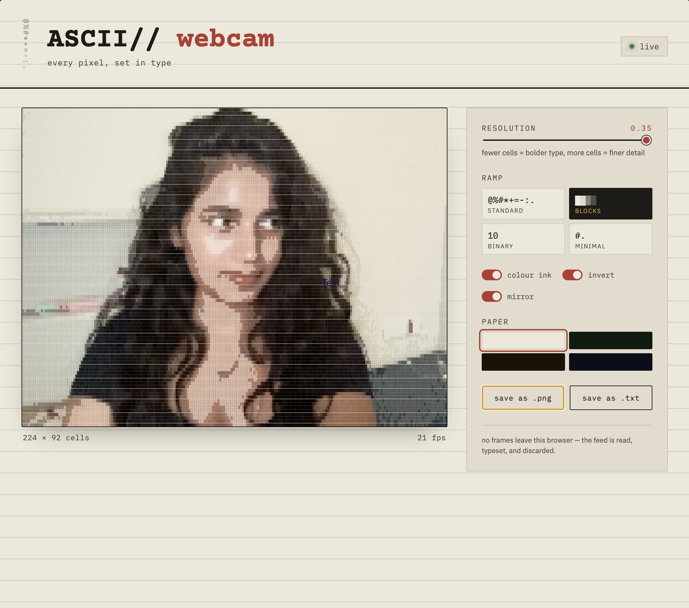

# ASCII// webcam

Live webcam feed, typeset in real time as ASCII characters — no frameworks, no dependencies, just canvas and JS.





## Features

- Real-time ASCII conversion of your webcam feed
- Adjustable resolution (cell density) via slider
- Four character ramps: standard (`@%#*+=-:.`), blocks (`█▓▒░`), binary (`10`), minimal (`#.`)
- Colour ink mode — render characters in their sampled RGB instead of monochrome
- Invert and mirror toggles
- Four paper/screen themes: paper, phosphor, amber, midnight
- Export the current frame as `.png` or the raw character grid as `.txt`
- Everything runs client-side — the video frame never leaves the browser

## How it works

Each frame is drawn to a hidden canvas, downsampled into a grid of cells, and the average brightness of each cell is mapped to a character from the selected density ramp (darkest → lightest). The result is redrawn onto the visible canvas using a monospace font, at roughly 30–60fps depending on grid size.

## Run it

No build step — just open `index.html` in a browser, or serve the folder locally:

```bash
npx serve .
```

Grant camera access when prompted.

## Stack

Vanilla JS, HTML5 Canvas, `getUserMedia`. No build tools, no libraries.

## License

MIT
# x
